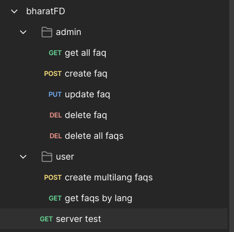
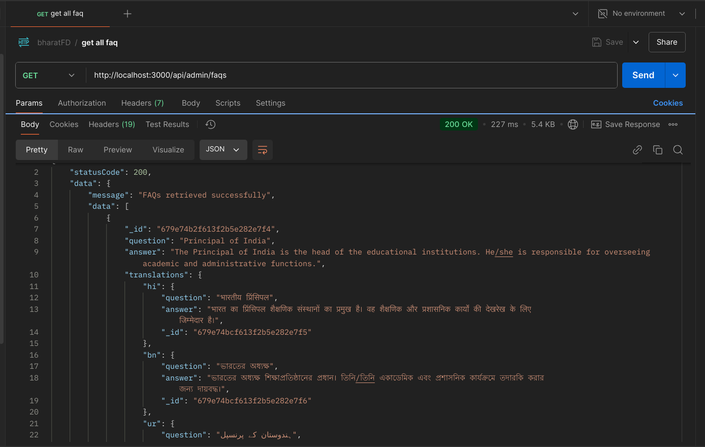
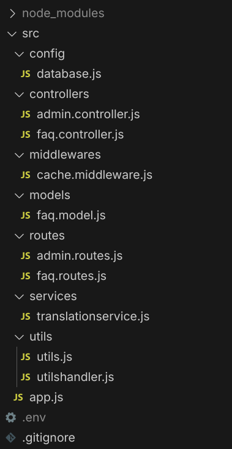
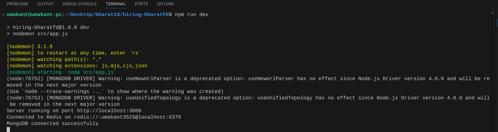

# **FAQ Management System**  

      

A **scalable FAQ Management System** with **multi-language support**, **real-time translations**, and **Redis caching** for optimized performance.  

## 🚀 Features  
- **Multi-language Support** (Hindi, Bengali, Urdu, Kannada, Gujarati)  
- **Real-time Translations** via Google Translate API  
- **Performance Boost** with Redis caching & MongoDB optimization  
- **Dockerized Deployment** with `docker-compose`  

## ⚙️ Installation  
```sh
git clone https://github.com/umakant3525/hiring-bharatFD.git
cd faq-management  
npm install  
npm run dev  
```  

## 🐳 Docker Setup  
```sh
docker-compose up --build -d  
docker-compose down  
```  

## 🔧 Configuration  
```sh
MONGO_URI=<your-mongo-url>  
REDIS_HOST=redis  
REDIS_PORT=6379  
PORT=5000  
```  

## 🧪 Testing  
```sh
npm test  
```  


❤️ Made with love for BharatFD by **Umakant Shinde**  

## Screenshots

### API Screenshot


### API Test Screenshot


### Folder Structure


### Terminal Run Screenshot
